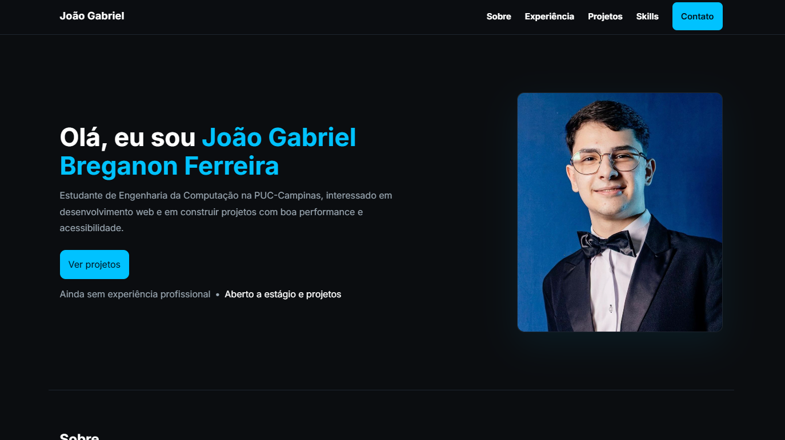

# Portfólio Pessoal - João Gabriel Breganon Ferreira

  

  Um portfólio pessoal moderno e responsivo desenvolvido com HTML, CSS e JavaScript, focado em acessibilidade, performance e um design clean.

  

## 📋 Sobre o Projeto

Este é meu portfólio pessoal, onde apresento minha trajetória como estudante de Engenharia da Computação na PUC-Campinas. O site foi desenvolvido com foco em:

* 🎨 **Design moderno e responsivo** - Totalmente adaptável a diferentes dispositivos.
* ♿ **Acessibilidade** - Seguindo as melhores práticas de acessibilidade web (WCAG).
* ⚡ **Performance** - Carregamento rápido e otimizado para uma excelente experiência do usuário.
* 🔍 **SEO** - Meta tags e estrutura semântica para melhor posicionamento nos buscadores.

---

## 🚀 Tecnologias Utilizadas

O projeto foi construído utilizando as seguintes tecnologias:

  

## 🎨 Características do Design

* **Tema:** Tema escuro com uma paleta de cores personalizada para conforto visual.
* **Tipografia:** Fonte "Inter" para garantir ótima legibilidade.
* **Layout:** Responsivo, construído com CSS Grid e Flexbox.
* **Interatividade:** Animações suaves e transições para uma navegação fluida.
* **Navegação:** Menu intuitivo e totalmente funcional em dispositivos móveis.

---

## 📱 Seções do Site

O portfólio está organizado nas seguintes seções:

1.  **Hero** - Apresentação pessoal e um call-to-action.
2.  **Sobre** - Descrição profissional, minha jornada e objetivos.
3.  **Experiência** - Uma timeline da minha carreira e formação.
4.  **Projetos** - Showcase dos trabalhos que mais me orgulho.
5.  **Skills** - Tecnologias e ferramentas que domino.
6.  **Contato** - Links para minhas redes sociais e email.

---
